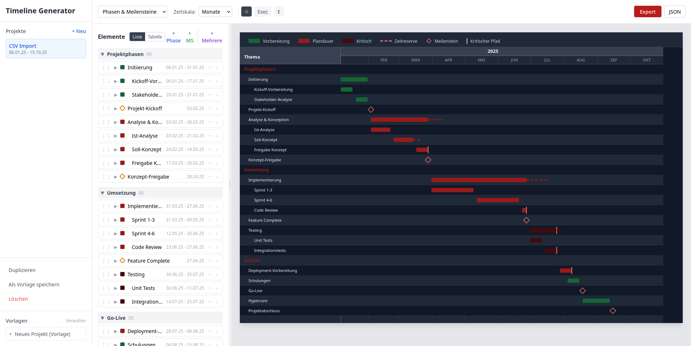
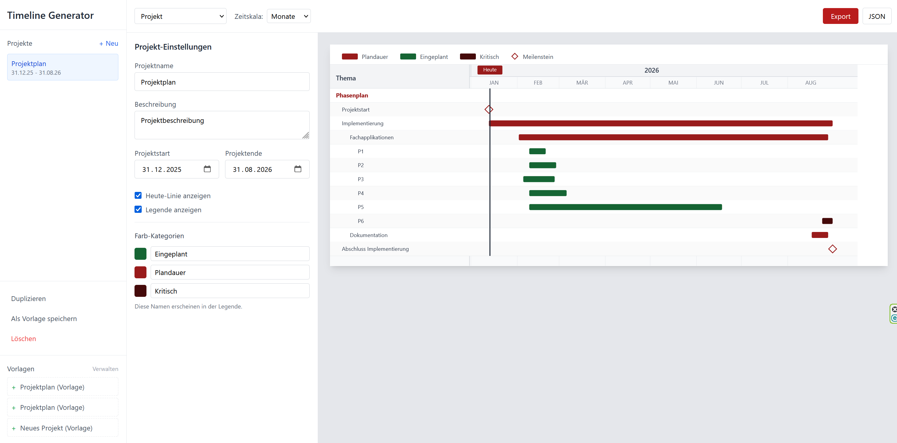
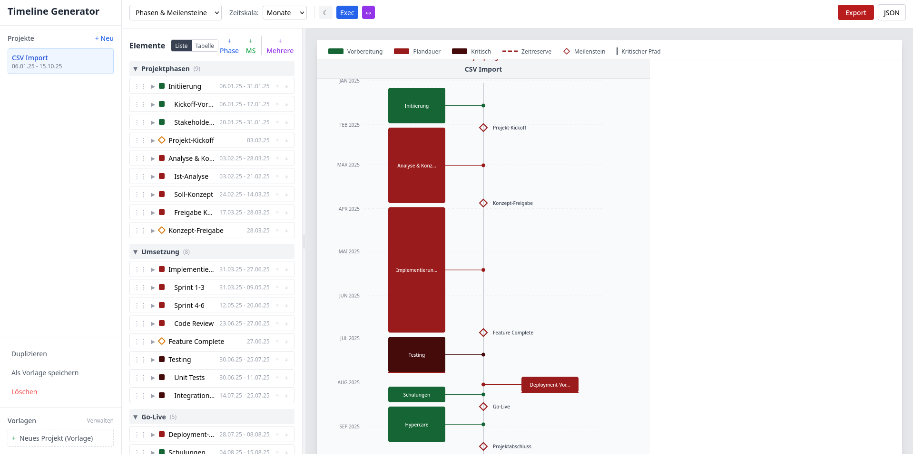
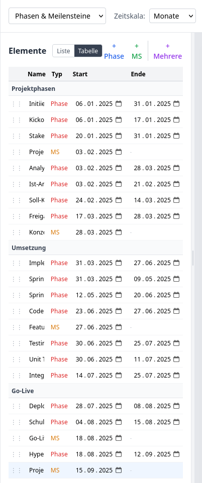
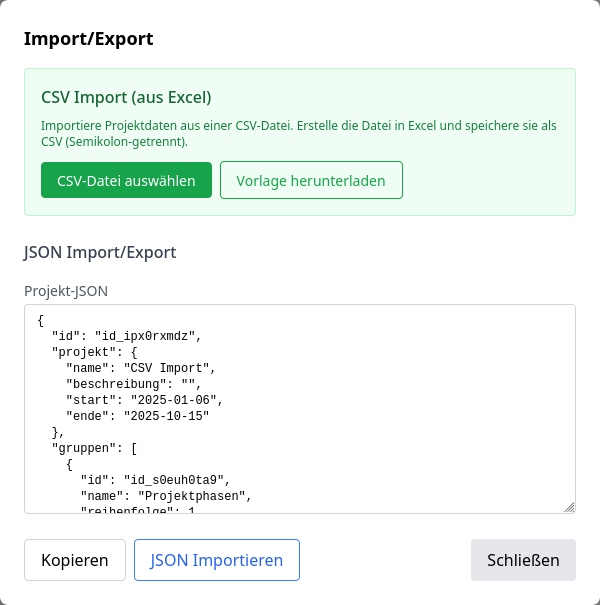
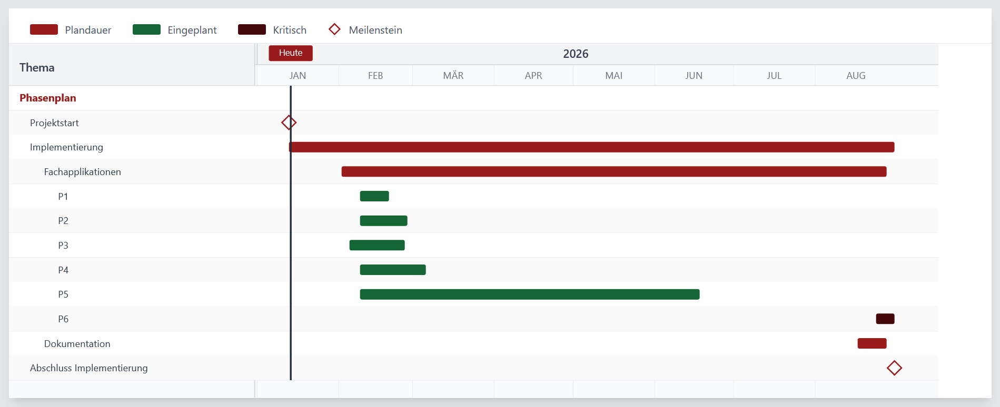
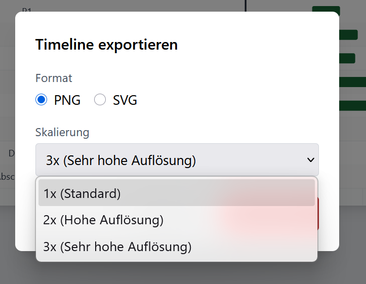

# Timeline Generator

[](https://opensource.org/licenses/MIT)
[](https://vuejs.org/)
[](https://tailwindcss.com/)
[](.)
[](CONTRIBUTING.md)

A powerful, browser-based timeline generator for project management and transition planning. Create professional Gantt-style timelines without any server or installation required.



---

## Features

- **Zero Installation** — Single HTML file, runs entirely in the browser
- **Offline Capable** — No internet connection needed after initial load
- **Project Management** — Create, duplicate, and manage multiple projects
- **Hierarchical Organization** — Groups with nested phases and milestones
- **Visual Timeline** — Clean SVG-based Gantt chart visualization
- **Drag & Drop** — Reorder elements intuitively
- **Templates** — Save and reuse project structures
- **Multiple Export Formats** — PNG, SVG, and JSON
- **Customizable Legend** — Define your own color categories
- **Today Marker** — Visual indicator for current date
- **Critical Path** — Highlight critical milestones
- **Buffer Visualization** — Show time reserves as dashed lines
- **Persistent Storage** — Auto-saves to browser's LocalStorage
- **Dark Mode** — Professional dark theme for presentations
- **Executive Summary** — Filter view showing only main phases and milestones
- **Vertical Roadmap** — Modern centered timeline with alternating elements
- **CSV Import** — Import timeline data from Excel/CSV files
- **Batch Input** — Add multiple elements at once
- **German UI** — Interface in German (contributions for i18n welcome!)

---

## Quick Start

### Option 1: Direct Use
1. Download `index.html`
2. Open it in any modern browser
3. Start creating your timeline!

### Option 2: Clone Repository
```bash
git clone https://github.com/xela-io/PM-Timeline-Generator.git
cd PM-Timeline-Generator
# Open index.html in your browser
```

No build tools, no dependencies, no setup required.

---

## Screenshots

<details>
<summary>Click to expand screenshots</summary>

### Main Interface


### Dark Mode


### Vertical Roadmap


### Table View (Editor)


### Import/Export


### Timeline View


### Export Options


</details>

---

## How It Works

### Data Structure
```
Project
├── Groups (organizational headers)
│   ├── Phases (time spans with start/end dates)
│   │   ├── Color categories (customizable)
│   │   ├── Critical path marking
│   │   └── Buffer/reserve time
│   └── Milestones (single date markers)
└── Settings
    ├── Time scale (months/quarters)
    ├── Today line visibility
    └── Custom color names
```

### Indentation Levels
Elements support 3 levels of visual indentation to create hierarchies:
- Level 0: Main items
- Level 1: Sub-items (indented)
- Level 2: Sub-sub-items (further indented)

### Templates
Save any project as a template with relative dates. When creating a new project from a template, all dates are automatically recalculated based on the new project start date.

---

## Tech Stack

| Technology | Purpose |
|------------|---------|
| [Vue 3](https://vuejs.org/) | Reactive UI framework (Composition API) |
| [Tailwind CSS](https://tailwindcss.com/) | Utility-first styling |
| SVG | Vector-based timeline rendering |
| [html2canvas](https://html2canvas.hertzen.com/) | PNG export |
| LocalStorage | Client-side persistence |
| HTML5 Drag & Drop | Native element reordering |

All dependencies loaded via CDN — no build step required.

---

## Export Options

| Format | Use Case |
|--------|----------|
| **PNG** | Presentations, documents (1x, 2x, 3x scaling) |
| **SVG** | High-quality print, further editing |
| **JSON** | Backup, data transfer, version control |

---

## Browser Support

Works in all modern browsers:
- Chrome/Edge (recommended)
- Firefox
- Safari

---

## Contributing

Contributions are welcome! Please read [CONTRIBUTING.md](CONTRIBUTING.md) for guidelines.

### Ideas for Contributions
- Internationalization (i18n) for English UI
- Dependency arrows between phases
- Undo/redo functionality
- Keyboard shortcuts
- Mobile-responsive improvements

---

## License

This project is licensed under the MIT License — see the [LICENSE](LICENSE) file for details.

---

## Acknowledgments

Built with modern web technologies. No backend required. Your data stays in your browser.

---

<p align="center">
  <sub>Made with care for project managers who need simple, effective timeline visualization.</sub>
</p>
